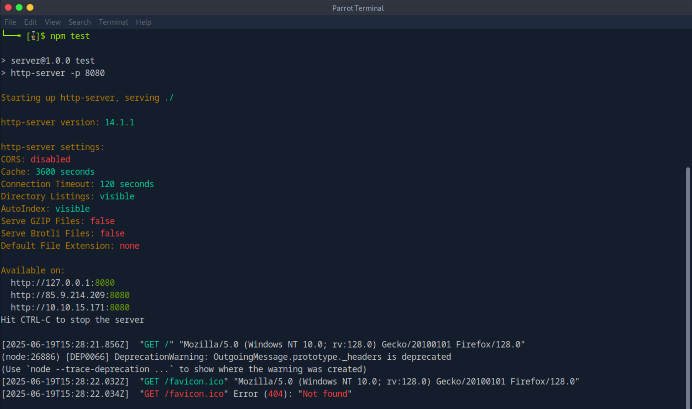
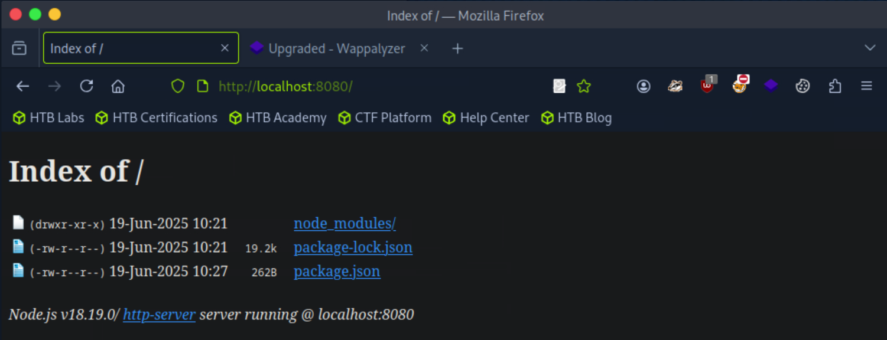
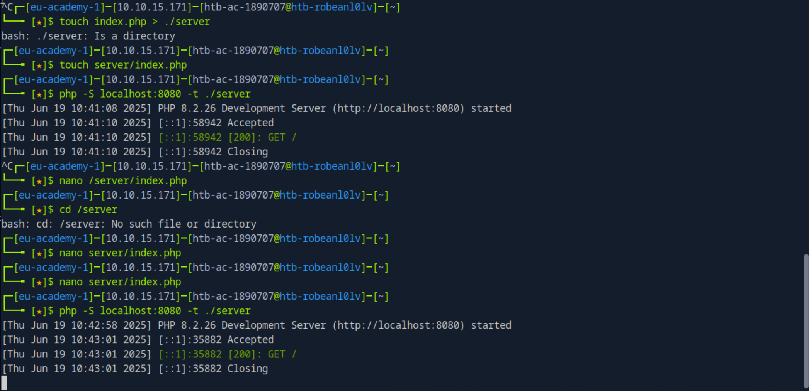
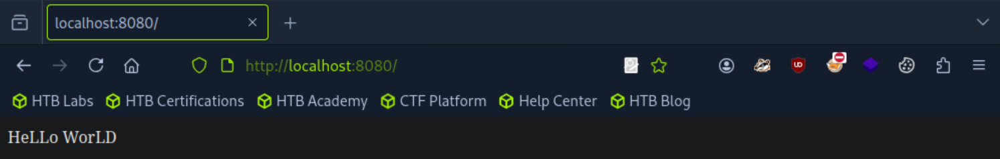
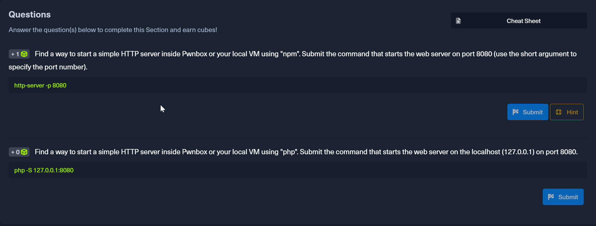
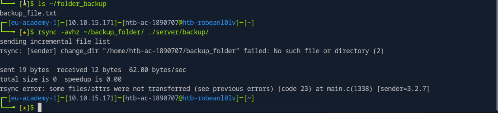
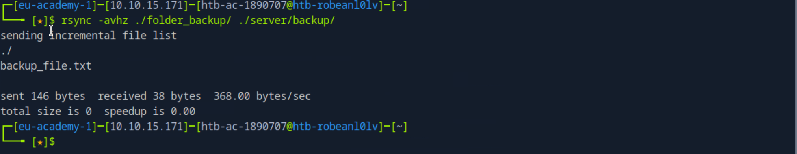
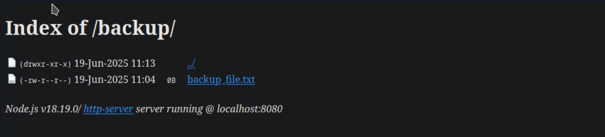
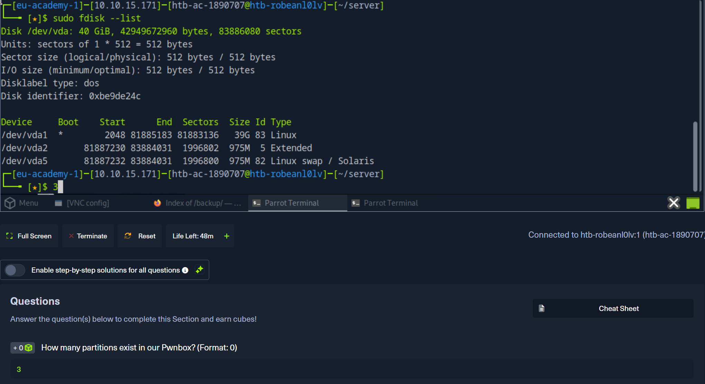

### **Topics Covered**

- Running HTTP servers with npm and PHP
- Basic troubleshooting and file serving
- Using rsync for file transfer
- Directory and file management
- Partition discovery with fdisk

---

### **Commands & Key Steps**

#### **1. Start HTTP server with npm**

- Created server directory:  
    `mkdir /server && cd /server`
    
- Initialized project:  
    `npm init -y`
    
- Installed http-server:  
    `npm install http-server`
    
- Edited `package.json` test script:
    
    `"test": "http-server -p 8080"`
    
- Ran server:  
    `npm test`
    
- Verified in browser:  
    `localhost:8080`
    

#### **2. Start PHP development server**

- Ran PHP server from parent dir:  
    `php -S localhost:8080 -t ./server`
    
- Created `server/index.php` with basic output.
    
- Confirmed PHP server response in browser.
    

#### **3. File Transfer with rsync**

- **First mistake:** wrong folder name (`backup_folder` instead of `folder_backup`), resulting in nothing copied.  

    _Fixed by using the correct folder name:_
    `rsync -avhz ./folder_backup/ ./server/backup/`

- Verified files appeared in `server/backup` and via browser.

#### **4. Remove directory and files**

- To nuke a directory:  
    `rm -rf directoryname`
    
- To empty a directory but keep it:  
    `rm -rf directoryname/*`
    

#### **5. List disk partitions**

- Checked partitions:  
    `sudo fdisk --list`
    
- Counted 3 partitions:
    - `/dev/vda1` — Linux
    - `/dev/vda2` — Extended
    - `/dev/vda5` — Swap
    
]
---
### 

> [!TIP] **Classic Mistakes & Fixes**
> - **Wrong folder path** in rsync: always check `ls` for exact names.
> - **Browser cache confusion**: always hard-refresh or use curl/wget to verify live server status.
> - **Typos in commands**: bash is ruthless, no auto-correct.

> [!Attention] **Takeaways**
>  - “http-server” via npm is passwordless—open to all by default.
>  - PHP’s built-in server needs an index file, or you get 404.
>  - Always check folder names and working directories.  

**Back to [[_index]]**
